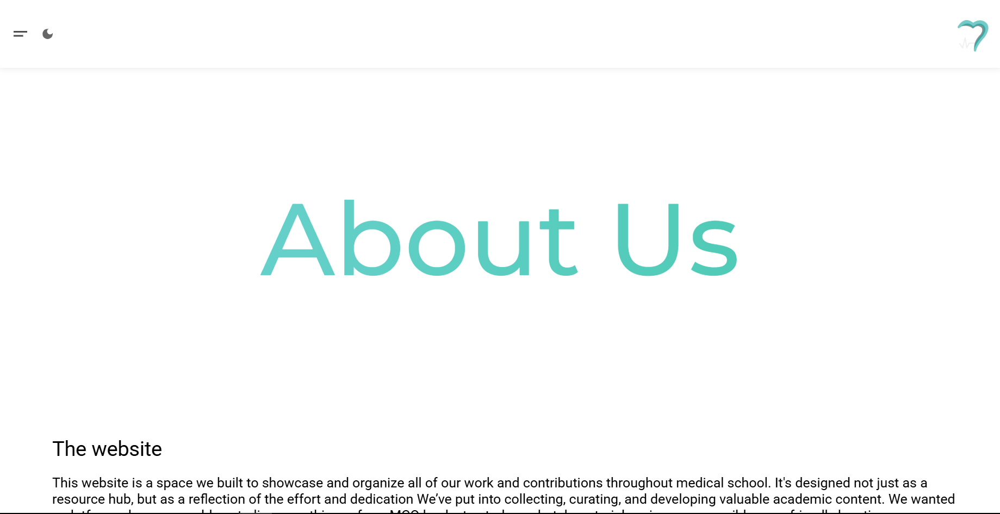
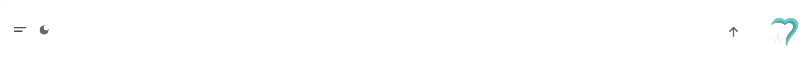
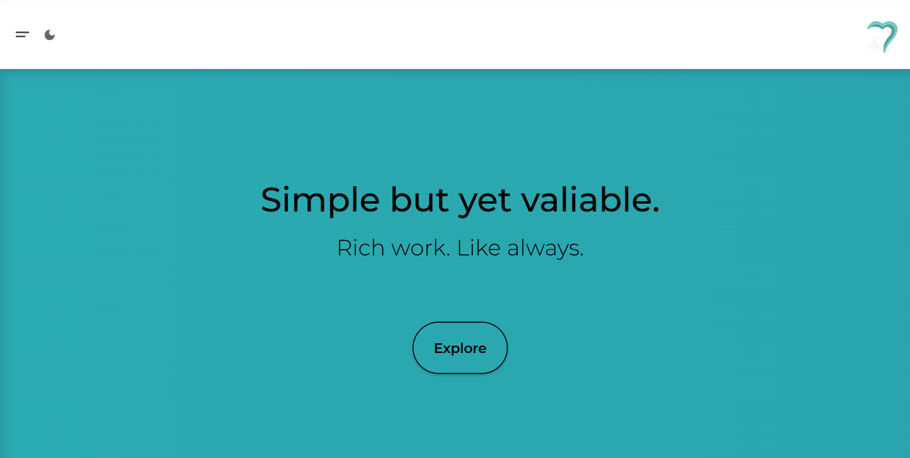

# UPDATES (current AND last version: 1.16)

---

**Version 1.0 - 1.2 | Early September**

1. Created a footer with a simple no-background design.
2. Designed the main page with a perfectly centered paragraph.
3. Published the website on GitHub.  
   [https://github.com/coronarymcq/library]

---

**Version 1.3 - 1.6 | Early-Mid-September**

Content was corrupted and therefore cannot be displayed.

---

**Version 1.7 | September 19**

1. Troubleshooting and bug fixes:

   - [UI fixes on iPhone and iPad]

   - [Resizing issues related to the header on all devices]

   - [Resizing issues related to the sidebar on all devices]

2. Minor UI fixes and improvements.

3. Smoothing out the transitions

4. Changed color scheme for the whole project.

---

**Version 1.8 | September 20-22**

1. Minor UI fixes and improvements.

2. Login page created (1st version), but not compatible with mobile.

   

3. Updated login page with precise resizing and scrolling mechanics for all devices (2nd version).

   

4. Show and hide button with an animated lock and unlock icon synced with the show and hide button on the login page.

5. Sign In page created (1st version), with warning messages for different rules.

   

6. Translation service is now available (so far for the index page, but not other pages).

     
     
   

7. Updated Header (5th version) and logo animation on all pages

     
     
     
   

8. ~~The small default title icon has been changed for the current logo of the website.~~

- **New (1st Oct)**: This has been **deleted** in the modern update to prevent source code complications.

---

**Version 1.9 | September 24-26**

1. Various issues and bugs have been fixed with the new content being prepared (so far, adding the Contact Us page)

2. More features and improved system management coming soon to enhance the entire site.

---

**Version 1.10-1.11 | The end of September - 1st of Oct**

1. Major and minor bugs and alignment issues on all pages except for the BAU page as it will be updated later on with a new design.

2. Animation while scrolling in the About Us page is now improved depending on the text that is fetched.

3. Planning for a better UI on mobile and tablets including the Main pages Like Home, BAU, About Us and others, along side the header and the footer

4. New dark and light theme been added with a synced theme logo and a total new color scheme for the whole project. (Now can be found in the Settings Button)

- Synced with the Login and Sign up page.

- The specific theme for the moving background for each the light or the dark have been updated in the Login and Sign up page.

5. New Auth Card design for both the Login and Sign Up page.

     
     
     
     
   

6. A new "Settings" button has been added to the header which is subject to change later on the next updates.

- It include both the "Language" and "Themes" Button which a user-friendly and easy to interact with.

- This button also has the translation and both themes applied to it.

- Resize measures is also applied.

    
    
  

7. A modern synced custom UI for the first pdf viewer on the About Us page.

- Though, an issue preventing the pdf viewer from working on the online github page, it will be fixed on the next update.

  
  

---

**Version 1.12 | February the 6th**

Due to time constraints, this project will now focus on gathering pre-existing Q banks and sharing them here. Users will not need to make any purchases, create accounts, or provide any information. Therefore, the following has been removed:

1. The login and sign-up pages and system will be removed for now. They may be re-worked in the future, but for now, these pages will be abandoned.

2. The resize issue will no longer be addressed. Phone users will be blocked from accessing the content unless they resize their browser window to a smaller size where the website can be displayed properly.

---

**Version 1.13 | June the 16th**

The following changes have been made in this update, along with some reconsiderations:

1. Once again, the website’s focus has shifted to serve primarily as a personal space for publishing work, rather than as an interactive platform for solving questions.
2. The translation feature has been removed, since most users understand basic English, and I will only use simple language to publish my work.
3. With the translation option removed, the settings button now only controls the theme; therefore, the settings menu has been simplified to only include theme switching.
4. The theme button has been redesigned as a modern, icon-based toggle that smoothly switches between light and dark modes.

  

5. A back-to-top button with smooth scrolling animation has been added, synced with the site’s content for easier navigation and user convenience.

  
  
  

6. In light of these changes, the header has been redesigned with a clean, streamlined layout.

7. Minor UI fixes.

---

**Version 1.15 | June the 24th**

Big changes have taken place in this new version, including the following:

1. A whole new redesigned **About Us** page, with a clear, colorful heading based on our color scheme. The heading changes dynamically with the currently applied theme, either dark or light.

  

2. Fixed an auto-resizing issue on the **About Us** page on iPads, caused by a scroll visibility–invisibility mechanism from a function in JavaScript.

3. A redesigned **Back to Top** button has been added, now placed in the **fixed top header** for easier interaction. The old fixed position was interfering with the layout and overlapping with the new homepage content.

    

4. A small footer has been added via JavaScript to mark the end of the webpage. It’s been redesigned from the old version.
    

5. Minor UI fixes and redesigns on the header for better consistency and appearance. Navigation issues also have been fixed.

6. New homepage content has been added, including a **main interface**, auto-switching **statements** every few seconds, and a button labeled **"Explore"** that smoothly scrolls the user to the first content section.
      

7. A **timeline** section has been added where the user can switch between semesters and years smoothly. The work completed in each academic period appears under a dedicated mini container.
       

---

**Version 1.16 | June the 27th**

With this release, I’ve introduced several key improvements:

1. A brand new **Library page**, featuring a large, organized table with tag-based filtering, a powerful search bar, and a dynamic filter mechanism to help users quickly find what they need.
   

2. The **search and filter logic** has gone through multiple iterations and refinements in JavaScript to ensure optimal performance and usability.
   
   
   
   
   
   

3. **Numerous bugs have been resolved**, alongside several minor UI improvements and design tweaks to enhance the overall user experience.

4. The project is now **fully complete**, stable, and ready for users to interact with and benefit from.

---
